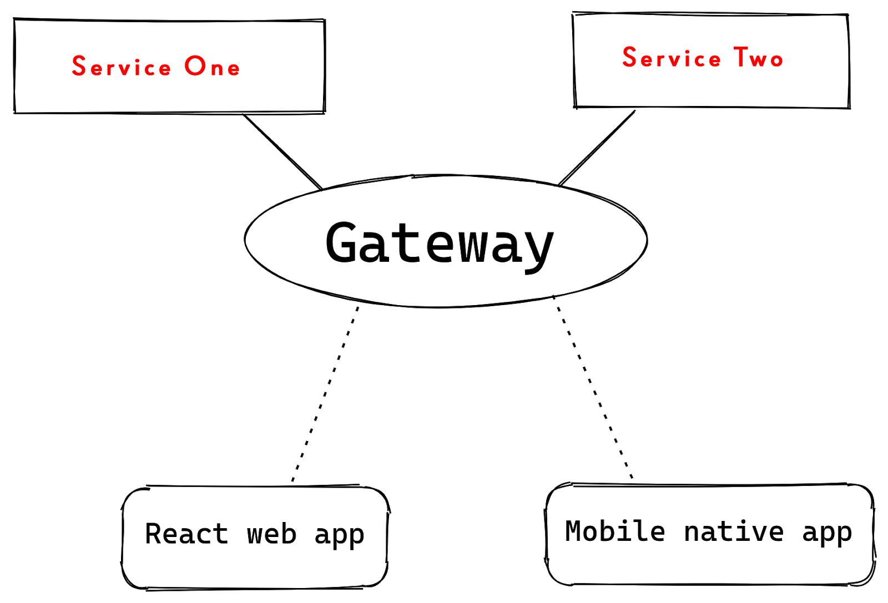

# <Your-Project-Title>

## estructura base apollo federation

2 subgraph and 1 supergraph:


## Table of Contents (Optional)

If your README is long, add a table of contents to make it easy for users to find what they need.

- [Installation](#installation)
- [Usage](#usage)
- [Run](#run)

## Installation
yarn

## Run


yarn dev

## Usage
Para crear el supergrafo
- npx rover supergraph compose --config ./supergraph-config.yaml > supergraph.graphql


    ```md
    
    ```
